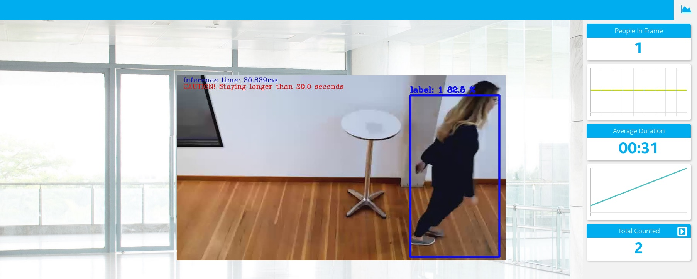
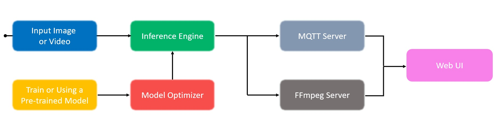

# OpenVINO People Counter


| Details of Software |                    |                   
|---------------------|--------------------|
| OS:                 | Ubuntu\* 18.04 LTS |
| OpenVINO:           | 2020.3 LTS         |
| Python:             |  3.6.9             |



## Summary

The solution of people counter application demonstrates a smart video IoT using Intel® hardware and software tools. It detects people in a designated area, providing the number of people in the frame, average duration of people in frame, and total count.

The use cases of a people counter app are quite extensive, such as shopping malls, metro station, retail chain, public venue, bank, and so on. For instance, once a person is detected, we can follow the individual’s behavior to further collaborate with union to take actions if required. 

In this case, we customize an alert time to print out ‘CAUTION’ if the assigned threshold is crossed. It can check if a person is staying longer than normal period of duration in a frame, then maybe we shall be aware of potential incident happened shortly.

## Workflow

By leveraging inference engine with a DNN model (pre-trained), this solution can detect people within a designated area by displaying a bounding box over them.

Concretely, the main functions of the counter are:

- Counting number of people in a current frame.
- Calculating the duration that a person is in the frame.
- Summing the total count of people from the start point. 

Then, the app will send the data to a local web server using the Paho MQTT Python package.



## Prerequisites

### Hardware

*  6th to 8th generation Intel® Core™ processor with Iris® Pro graphics or Intel® HD Graphics.
*  Intel® Integrated GPUs, or VPUs (NCS2).

### Software

*   [Ubuntu 18.04 LTS](https://releases.ubuntu.com/18.04/?_ga=2.147695671.1840577867.1601734098-557861503.1601734098)
    
    **Note:** 4.14+ Linux kernel is recommended. Run the following command to view the kernel version:
    
     ```
     uname -a
     ```
*   [Intel® Distribution of OpenVINO™ toolkit 2020.3 LTS release](https://software.intel.com/content/www/us/en/develop/articles/openvino-2020-3-lts-relnotes.html)
    
    To verify the OpenVINO version:
    ```
    ls -al /opt/intel/openvino
    ```
*   Python 3.5 or newer
    
    To check the Python version:
    ```
    python3 --version
    ```
*   Node v6.17.1
*   Npm v3.10.10
*   MQTT Mosca\* server
        
## Setup

### Install OpenVINO™ 

The detailed guide of installing Intel® Distribution of OpenVINO™ toolkit for Linux* can be referred to [here](https://docs.openvinotoolkit.org/latest/openvino_docs_install_guides_installing_openvino_linux.html).

### Install Nodejs and its depedencies

- To install Nodejs and Npm, run the below commands:
	```
	curl -sSL https://deb.nodesource.com/gpgkey/nodesource.gpg.key | sudo apt-key add -
	VERSION=node_6.x
	DISTRO="$(lsb_release -s -c)"
	echo "deb https://deb.nodesource.com/$VERSION $DISTRO main" | sudo tee /etc/apt/sources.list.d/nodesource.list
	echo "deb-src https://deb.nodesource.com/$VERSION $DISTRO main" | sudo tee -a /etc/apt/sources.list.d/nodesource.list
	sudo apt-get update
	sudo apt-get install nodejs
	```

### Install the following dependencies

```
sudo apt update
sudo apt-get install python3-pip
pip3 install numpy
pip3 install paho-mqtt
sudo apt install libzmq3-dev libkrb5-dev
sudo apt install ffmpeg
```

## Build
**1. Clone this repository to desired location:**
```
git clone https://github.com/jonathanyeh0723/OpenVINO_People_Counter_App
```
**2. Source the OpenVINO environment**
```
source /opt/intel/openvino/bin/setupvars.sh
```
   We should be able to see the following returned, if it is successful:
```
[setupvars.sh] OpenVINO environment initialized
```
**3. Install npm**

There are three components that need to be running in separate terminals for this application to work:

-   MQTT Mosca server 
-   Node.js* Web server
-   FFmpeg server
     
Go to people-counter-python directory
```
cd OpenVINO_People_Counter_App/people-counter-python/
```
* For mosca server:
   ```
   cd webservice/server
   npm install
   ```

* For Web server:
  ```
  cd ../ui
  npm install
  ```
  **Note:** If any unexpected configuration errors occur while using **npm install**, use the below commands for debugging:
   ```
   npm cache clean --force 
   rm -rf node_modules package-lock.json
   npm install
   ```
   The related issue can be found [here](https://stackoverflow.com/questions/42308879/how-to-solve-npm-error-npm-err-code-elifecycle) on Stack Overflow.

## Run the application

Go to people-counter-python directory:
```
cd <path_to_people-counter-python_directory>
```
### Step 1 - Start the Mosca server

```
cd webservice/server/node-server
node ./server.js
```

You should see the following message, if successful:
```
connected to ./db/data.db
Mosca server started.
```

### Step 2 - Start the GUI

Open new terminal and run below commands.
```
cd ../../ui
npm run dev
```

You should see the following message in the terminal.
```
webpack: Compiled successfully
```

### Step 3 - FFmpeg Server

Open new terminal and run the below commands.
```
cd ../..
sudo ffserver -f ./ffmpeg/server.conf
```

### Step 4 - Run the code

Open a new terminal to run the code.

#### Setup the environment

You must configure the environment to use the Intel® Distribution of OpenVINO™ toolkit one time per session by running the following command:
```
source /opt/intel/openvino/bin/setupvars.sh -pyver 3.5
```
#### Running on the CPU

When running Intel® Distribution of OpenVINO™ toolkit Python applications on the CPU, the CPU extension library is required. This can be found at /opt/intel/openvino/deployment_tools/inference_engine/lib/intel64/

Though by default application runs on CPU, this can also be explicitly specified by ```-d CPU``` command-line argument:

```
python3.5 main.py -i resources/Pedestrain_Detect_2_1_1.mp4 -m /opt/intel/openvino/deployment_tools/tools/model_downloader/Retail/object_detection/pedestrian/rmnet_ssd/0013/dldt/person-detection-retail-0013.xml -l /opt/intel/openvino/deployment_tools/inference_engine/lib/intel64/libcpu_extension_sse4.so -d CPU -pt 0.6 | ffmpeg -v warning -f rawvideo -pixel_format bgr24 -video_size 768x432 -framerate 24 -i - http://localhost:8090/fac.ffm
```
To see the output on a web based interface, open the link [http://localhost:8080](http://localhost:8080/) in a browser.


