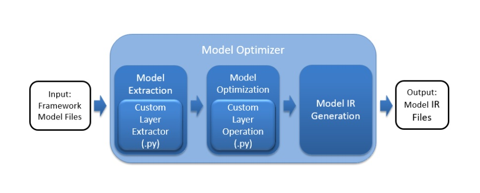

# Write-Up

The following address an explanation of the process behind converting any custom layers, as well as explaining the potential reasons for handling custom layers in a trained model.

## Explaining Custom Layers in OpenVINO™

According to [Custom Layers Guide](https://docs.openvinotoolkit.org/latest/openvino_docs_HOWTO_Custom_Layers_Guide.html), we learn that custom layers are layers that are not included in the list of known layers. If your topology contains any layers that are not in the list of known layers, the Model Optimizer classifies them as custom.

Before building the model's internal representation, the Model Optimizer will search the list of known layers for each layer contained in the input model topology, optimizing the model, and then producing the Intermediate Representation files.

The Inference Engine loads the layers from the input model IR files into the specified device plugin, which will search a list of known layer implementations for the device.

On the other hand, because Inference Engine use different data layouts of tensors compared to TensorFlow, so we'll have to do data preprocessing in advance. Then, these tensors are flattened out to required data format for inference. The results Intermediate Representation including .xml and .bin files, which detailing our topology and weights.

## Compare Model Performance

## Assess Model Use Cases the given scenario.

The use cases of a people counter app are quite extensive, such as:
- metro station
- retail chain
- public venue
- bank system
- airline

For example, we can customize an alarm or notification once the counter detects above a certain number of people on video, or people are on camera longer than a certain length of time.

## Assess Effects on End User Needs

To deploy people counter app to the edge, we must consider end user requirement with great attention. These factors are lighting, model accuracy, camera focal length/image size, and so forth. Since it does exist some trade-off between performance and cost, the best fit is depended on given scenario.

For instance, imagine a public venue host would like to control the total people in the active area to maintain the quality of this event. Since the budget is limited, it would be great to have a cost-effective and lightweight smart IoT device to count person automatically in the entrance, rather than hiring a guard to watch the surveillance system and do calculations manually. In this case we can suppose the hardware requirement is not that critical and some performance deviation is acceptable, so that we can choose a Raspberry Pi + NCS2 solution.

## Documenting Model Research

